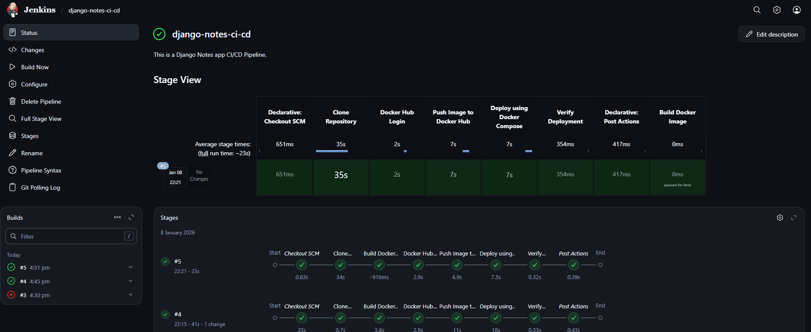

# Django React Notes App – CI/CD with Jenkins & Docker

## 📌 Project Overview

This project demonstrates a **complete end-to-end CI/CD implementation** for a **containerized full-stack Notes application** using modern DevOps tools and practices.

The application stack includes:

* **Django REST Framework** – Backend API
* **React** – Frontend single-page application
* **NGINX** – Reverse proxy and static content server
* **MySQL** – Relational database
* **Docker & Docker Compose** – Containerization and orchestration
* **Jenkins** – CI/CD automation

The primary objective of this project is to practice and showcase **real-world DevOps workflows**, including automated builds, image publishing, secure credential handling, and Docker-based deployments through a Jenkins pipeline.

---

## 🏗️ Architecture Overview

**High-level workflow:**

Developer Push
      │
      ▼
GitHub Repository
      │
      ▼
Jenkins CI/CD Pipeline
      ├── Build Docker Image
      ├── Push Image to Docker Hub
      │
      ▼
Docker Compose Deployment
      ├── Django Application Container
      ├── NGINX Reverse Proxy
      └── MySQL Database



---

## ⚙️ Technology Stack

### Application Layer

* Django (Backend API)
* React (Frontend SPA)
* Gunicorn (Production WSGI server)
* NGINX (Reverse proxy & static file serving)

### DevOps & Infrastructure

* Docker
* Docker Compose
* Jenkins (Declarative Pipeline)
* Docker Hub (Container Registry)

---

## 📁 Project Structure

```text
.
├── api/                 # Django API application
├── mynotes/             # React frontend source code
├── notesapp/            # Django project configuration
├── nginx/
│   ├── Dockerfile       # Custom NGINX image
│   └── default.conf     # NGINX reverse proxy configuration
├── Dockerfile           # Django application Dockerfile
├── docker-compose.yml   # Multi-container orchestration
├── Jenkinsfile          # Jenkins CI/CD pipeline
├── requirements.txt     # Python dependencies
├── manage.py
└── .env                 # Environment variables
```

---

## 🚀 CI/CD Pipeline Workflow

The Jenkins pipeline automates the following steps:

1. **Source Code Checkout**

   * Clones the latest code from the GitHub repository

2. **Docker Image Build**

   * Builds the Django application image using the Dockerfile

3. **Docker Hub Authentication**

   * Authenticates securely using Jenkins stored credentials

4. **Push Image to Docker Hub**

   * Pushes the image with the `latest` tag to the registry

5. **Deployment via Docker Compose**

   * Pulls the latest application image
   * Builds the NGINX image locally (infrastructure-level service)
   * Starts all containers in detached mode

6. **Deployment Verification**

   * Confirms that all containers are running successfully

7. **Post-build Cleanup**

   * Removes unused Docker images to optimize disk usage

---

## 🐳 Docker Strategy

### Django Application

* Built during the **CI phase (Jenkins)**
* Stored in Docker Hub
* Pulled during deployment for consistency

### NGINX

* Built locally using Docker Compose
* Contains custom reverse proxy and frontend configuration
* Treated as an **infrastructure component**

### MySQL

* Uses the official `mysql:8.0` image
* Data persistence handled through Docker named volumes

---

## 🔐 Security Best Practices

* Docker Hub credentials securely managed using **Jenkins Credentials Manager**
* No secrets hardcoded in source code or pipeline
* Environment variables managed through `.env` files

---

## 🧪 Run Locally (Without Jenkins)

To run the application locally using Docker Compose:

```bash
docker-compose build
docker-compose up -d
```

**Access URLs:**

* Frontend: `http://localhost`
* Backend API: `http://localhost/api/`

---

## 🧠 Key DevOps Learnings

* Designing CI/CD pipelines using Jenkins Declarative syntax
* Docker image build-once, deploy-everywhere approach
* Clear separation of CI (build) and CD (deployment)
* Secure credential handling in Jenkins
* Practical Docker Compose deployment strategies

---

## 🔮 Future Enhancements

* Docker image versioning using build numbers
* Container security scanning with Trivy
* Code quality analysis using SonarQube
* Deployment on Azure VM or AKS
* GitHub webhook–based pipeline triggers
* GitOps-based deployments using ArgoCD

---

## 📌 Project Purpose

This project is created **purely for learning and demonstration purposes** to practice:

* Jenkins CI/CD pipelines
* Docker and container orchestration
* Real-world DevOps best practices

Anyone can clone, fork, and use this repository to learn CI/CD and Docker-based deployments.

---

## 👨‍💻 Author

**Rohit Sharma**
DevOps Engineer | CI/CD | Docker | Kubernetes | Azure

⭐ If you find this project useful, feel free to explore, fork, and experiment.

---


